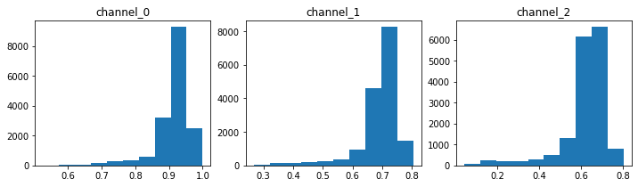
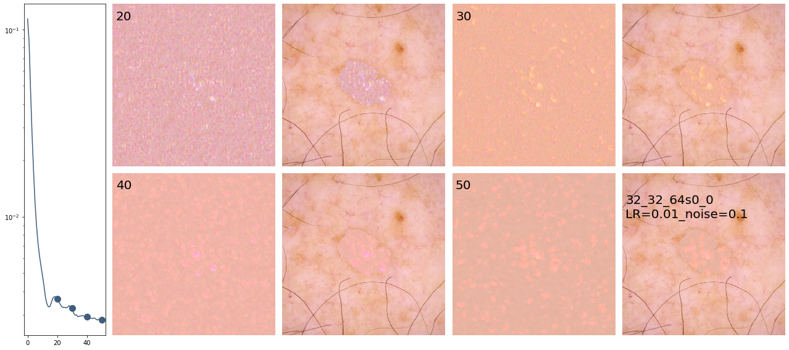

# Inpaint melanoma skin lesions
> Inpaint melanoma skin lesions using deep image prior.


This file will become your README and also the index of your documentation.

## Install

`pip install your_project_name`

## How to use

Fill me in please! Don't forget code examples:

```python
import numpy as np
import matplotlib.pyplot as plt
import torch
import time
from torch import nn
from inpaint_melanoma.skip import *
from PIL import Image
# from utils.common_utils import *
# from models.skip import *
```

```python
filename = 'ISIC_0076742'
# if cloud
# from google.colab import drive
# drive.mount('/content/gdrive/')
# path_source = '/content/gdrive/My Drive/KCL/melanoma/size_512/'
# path_img_dest = '/content/gdrive/My Drive/KCL/melanoma/results_512/'
# if local
path_source = '/mnt/c/Users/octav/Documents/Datasets/melanoma/size_512/'
path_img_dest = '/mnt/c/Users/octav/Documents/Datasets/melanoma/results_size_512/'
```

```python
img = plt.imread(f'{path_source}{filename}.jpg')
mask_lesion = np.load(f'{path_source}mask_{filename}.npz')
mask_lesion = mask_lesion.f.arr_0
mask_inpain = ~mask_lesion
# reshape and normalize
img = channels_first_last(img,'first')
img = img/255.
mask_inpain = mask_inpain.astype('int')
print(f'img: {np.shape(img), np.shape(mask_inpain)}')
```

    img: ((3, 512, 512), (512, 512))


## parameters

```python
# parameters
run_epochs = 51
channels_input = 32
channels_layers = [32, 64]
channels_skip = [0]*len(channels_layers)
channels_layers_str = [str(i) for i in channels_layers]
channels_skip_str = [str(i) for i in channels_skip]
layers_str ='_'.join(channels_layers_str)
skip_str ='_'.join(channels_skip_str)
name = f'{run_epochs}_{channels_input}_{layers_str}s{skip_str}'
name_for_fig = f'{channels_input}_{layers_str}s{skip_str}'
```

```python
lesion_size = np.where(mask_inpain==0)
lesion_size = len(lesion_size[0])
```

```python
skin_sample_ch0_np, skin_sample_ch1_np, skin_sample_ch2_np = get_sample_distributions_per_channel(img, mask_inpain, lesion_size)
fig, ax = plt.subplots(1,3, figsize=(12,3))
ax[0].hist(skin_sample_ch0_np); ax[0].set_title('channel_0')
ax[1].hist(skin_sample_ch1_np); ax[1].set_title('channel_1')
ax[2].hist(skin_sample_ch2_np); ax[2].set_title('channel_2');
```





```python
# if local
device = torch.device('cuda' if torch.cuda.is_available() else 'cpu')
if device == 'cuda':
    dtype = torch.cuda.FloatTensor
else:
    dtype = torch.FloatTensor
# if cloud
# dtype = torch.cuda.FloatTensor
PLOT = True
torch.cuda.empty_cache()
skin_sample_ch0 = torch.tensor(np.asarray(skin_sample_ch0_np)).type(dtype)
skin_sample_ch1 = torch.tensor(np.asarray(skin_sample_ch1_np)).type(dtype)
skin_sample_ch2 = torch.tensor(np.asarray(skin_sample_ch2_np)).type(dtype)
```

```python
def closure():
    global i
    images_all = []
    
    if param_noise:
        for n in [x for x in net.parameters() if len(x.size()) == 4]:
            n = n + n.detach().clone().normal_() * n.std() / 50
    
    net_input = net_input_saved
    if reg_noise_std > 0:
        net_input = net_input_saved + (noise.normal_() * reg_noise_std)
        
    out = net(net_input)
    
    # ussing KL per channel
    mask_skin = mask_var[0]
    mask_lesion = -mask_skin+1
    out_ch = torch.squeeze(out)
    lesion_only_ch0 =  out_ch[0][torch.where((out_ch[0] * mask_lesion)>0)]
    lesion_only_ch1 =  out_ch[1][torch.where((out_ch[1] * mask_lesion)>0)]
    lesion_only_ch2 =  out_ch[2][torch.where((out_ch[2] * mask_lesion)>0)]
    kl_loss_ch0 = KL(torch.log_softmax(lesion_only_ch0, dim=0), torch.softmax(skin_sample_ch0, dim=0))
    kl_loss_ch1 = KL(torch.log_softmax(lesion_only_ch1, dim=0), torch.softmax(skin_sample_ch1, dim=0))
    kl_loss_ch2 = KL(torch.log_softmax(lesion_only_ch2, dim=0), torch.softmax(skin_sample_ch2, dim=0))
    
    total_loss = mse(out * mask_var, img_var * mask_var) + kl_loss_ch0 + kl_loss_ch2 + kl_loss_ch2
    total_loss.backward()
        
    print ('Iteration %05d    Loss %.12f' % (i, total_loss.item()), '\r', end='')
    
    if  PLOT:
        out_np = torch_to_np(out)
        image_to_save = out_np
        images_all.append(image_to_save)
        
    i += 1    

    return total_loss, images_all
```

```python
pad = 'zero' 
OPT_OVER = 'net'
OPTIMIZER = 'adam'
INPUT = 'noise'
input_depth = channels_input 
num_iter = run_epochs 
param_noise = True
show_every = 500
reg_noise_std = 0.1
LR = 0.01
restart_i = 0
restart = True
params = f'LR={LR}_noise={reg_noise_std}'
```

```python
mse_error_all = []
img_np = img
img_mask_np = mask_inpain
```

```python
while restart == True:
    start = time.time()
    print(f'training initialization {restart_i} with LR = {LR:.12f}')
    restart_i += 1
    # Loss
    mse = torch.nn.MSELoss().type(dtype)
    KL = nn.KLDivLoss()
    img_var = np_to_torch(img_np).type(dtype)
    mask_var = np_to_torch(img_mask_np).type(dtype)

    net = skip(input_depth, img_np.shape[0], 
            num_channels_down = channels_layers, 
            num_channels_up   = channels_layers[::-1], 
            num_channels_skip = channels_skip, 
            upsample_mode='nearest', filter_skip_size=1, filter_size_up=3, filter_size_down=3, 
            need_sigmoid=True, need_bias=True, pad=pad, act_fun='LeakyReLU').type(dtype)
    net = net.type(dtype)        
    net_input = get_noise2(input_depth, INPUT, img_np.shape[1:], noise_type='n').type(dtype)

    i = 0
    net_input_saved = net_input.detach().clone()
    noise = net_input.detach().clone()
    print(f'noise: {type(noise.detach().cpu().numpy())}, {np.shape(noise.detach().cpu().numpy())}, {np.min(noise.detach().cpu().numpy()), np.mean(noise.detach().cpu().numpy()), np.max(noise.detach().cpu().numpy())}')

    p = get_params(OPT_OVER, net, net_input)
    mse_error, images_generated_all, best_iter, restart = optimize_melanoma_v1(OPTIMIZER, p, closure, LR, num_iter, show_every, path_img_dest, restart, annealing=True, lr_finder_flag=False)
    
    mse_error = [i.detach().cpu().numpy() for i in mse_error]

    if restart_i % 10 == 0: # reduce lr if the network is not learning with the initializations
        LR /= 1.2
    if restart_i == 30: # if the network cannot be trained continue (might not act on for loop!!)
        continue
```

    training initialization 0 with LR = 0.010000000000
    using get_noise2


      0%|          | 0/51 [00:00<?, ?it/s]

    noise: <class 'numpy.ndarray'>, (1, 32, 512, 512), (-0.5126995, 3.7638987e-05, 0.48123914)
    0


    /home/octaviomtz/miniconda3/envs/torch/lib/python3.6/site-packages/torch/nn/functional.py:1958: UserWarning: reduction: 'mean' divides the total loss by both the batch size and the support size.'batchmean' divides only by the batch size, and aligns with the KL div math definition.'mean' will be changed to behave the same as 'batchmean' in the next major release.
      warnings.warn("reduction: 'mean' divides the total loss by both the batch size and the support size."
      2%|▏         | 1/51 [00:04<03:38,  4.37s/it]

    1


      4%|▍         | 2/51 [00:08<03:33,  4.35s/it]

    2


      6%|▌         | 3/51 [00:12<03:18,  4.14s/it]

    3


      8%|▊         | 4/51 [00:17<03:30,  4.48s/it]

    4


     10%|▉         | 5/51 [00:23<03:47,  4.95s/it]

    5


     12%|█▏        | 6/51 [00:29<03:55,  5.24s/it]

    6


     14%|█▎        | 7/51 [00:37<04:29,  6.12s/it]

    7


     16%|█▌        | 8/51 [00:48<05:19,  7.43s/it]

    8


     18%|█▊        | 9/51 [00:53<04:46,  6.82s/it]

    9


     20%|█▉        | 10/51 [01:00<04:42,  6.89s/it]

    10


     22%|██▏       | 11/51 [01:08<04:42,  7.05s/it]

    11


     24%|██▎       | 12/51 [01:13<04:10,  6.43s/it]

    12


     25%|██▌       | 13/51 [01:18<03:52,  6.11s/it]

    13


     27%|██▋       | 14/51 [01:23<03:33,  5.76s/it]

    14


     29%|██▉       | 15/51 [01:28<03:16,  5.46s/it]

    15


     31%|███▏      | 16/51 [01:33<03:06,  5.33s/it]

    16


     33%|███▎      | 17/51 [01:39<03:08,  5.53s/it]

    17


     35%|███▌      | 18/51 [01:44<03:05,  5.62s/it]

    18


     37%|███▋      | 19/51 [01:52<03:15,  6.10s/it]

    19


     39%|███▉      | 20/51 [01:56<02:48,  5.44s/it]

    20


     41%|████      | 21/51 [02:00<02:30,  5.03s/it]

    21


     43%|████▎     | 22/51 [02:04<02:20,  4.84s/it]

    22


     45%|████▌     | 23/51 [02:09<02:12,  4.74s/it]

    23


     47%|████▋     | 24/51 [02:13<02:05,  4.66s/it]

    24


     49%|████▉     | 25/51 [02:17<01:55,  4.44s/it]

    25


     51%|█████     | 26/51 [02:21<01:50,  4.43s/it]

    26


     53%|█████▎    | 27/51 [02:26<01:44,  4.34s/it]

    27


     55%|█████▍    | 28/51 [02:30<01:37,  4.24s/it]

    28


     57%|█████▋    | 29/51 [02:34<01:36,  4.40s/it]

    29


     59%|█████▉    | 30/51 [02:39<01:34,  4.52s/it]

    30


     61%|██████    | 31/51 [02:45<01:40,  5.03s/it]

    31


     63%|██████▎   | 32/51 [02:52<01:46,  5.63s/it]

    32


     65%|██████▍   | 33/51 [02:58<01:41,  5.63s/it]

    33


     67%|██████▋   | 34/51 [03:02<01:28,  5.23s/it]

    34


     69%|██████▊   | 35/51 [03:09<01:28,  5.54s/it]

    35


     71%|███████   | 36/51 [03:13<01:18,  5.25s/it]

    36


     73%|███████▎  | 37/51 [03:18<01:11,  5.08s/it]

    37


     75%|███████▍  | 38/51 [03:22<01:01,  4.76s/it]

    38


     76%|███████▋  | 39/51 [03:26<00:56,  4.72s/it]

    39


     78%|███████▊  | 40/51 [03:30<00:49,  4.46s/it]

    40


     80%|████████  | 41/51 [03:34<00:43,  4.30s/it]

    41


     82%|████████▏ | 42/51 [03:38<00:37,  4.18s/it]

    42


     84%|████████▍ | 43/51 [03:42<00:33,  4.15s/it]

    43


     86%|████████▋ | 44/51 [03:47<00:29,  4.24s/it]

    44


     88%|████████▊ | 45/51 [03:52<00:26,  4.43s/it]

    45


     90%|█████████ | 46/51 [03:55<00:21,  4.23s/it]

    46


     92%|█████████▏| 47/51 [03:59<00:16,  4.15s/it]

    47


     94%|█████████▍| 48/51 [04:03<00:11,  3.97s/it]

    48


     96%|█████████▌| 49/51 [04:07<00:07,  3.95s/it]

    49


     98%|█████████▊| 50/51 [04:10<00:03,  3.84s/it]

    50


    100%|██████████| 51/51 [04:14<00:00,  3.70s/it]

    Iteration 00050    Loss 0.002824939787 

    100%|██████████| 51/51 [04:15<00:00,  5.00s/it]


```python
save_epochs = [1,2,3,4,5] #[10,20,40,80,100]
images=[]
images_raw=[]
for i in save_epochs:
    img_tmp = images_generated_all[i] * mask_lesion + img *  mask_inpain
    img_tmp = np.swapaxes(img_tmp[0], 0,1); img_tmp = np.swapaxes(img_tmp, 1,2)
    images.append(img_tmp)
    raw_tmp = images_generated_all[i]
    raw_tmp = np.swapaxes(raw_tmp[0], 0,1); raw_tmp = np.swapaxes(raw_tmp, 1,2)
    images_raw.append(raw_tmp)
```

```python
plot_inpaints_pairs(mse_error, images_raw, images, save_epochs, filename, name_for_fig, params)
```





```python
# save individual images
image_denorm = [denormalizePatches(i) for i in images]
image_raw_denorm = [denormalizePatches(i) for i in images_raw]
for (img_to_save, epoch_to_save) in zip(image_denorm, save_epochs):
    im2save = Image.fromarray(img_to_save.astype(np.uint8))
    im2save.save(f'{path_img_dest}final/{filename}_{name}_{epoch_to_save:04d}.png')
for (img_to_save, epoch_to_save) in zip(image_raw_denorm, save_epochs):
    im2save = Image.fromarray(img_to_save.astype(np.uint8))
    im2save.save(f'{path_img_dest}raw/{filename}_{name}_{epoch_to_save:04d}.png')
np.save(f'{path_img_dest}mse/{filename}_{name}.npy', mse_error)
```
